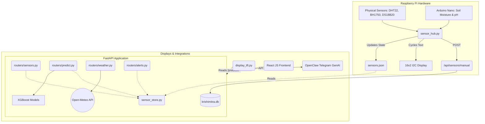

# System Architecture

KrishiMitra follows a decoupled, service-oriented architecture designed to run on edge hardware (Raspberry Pi). 

## High-Level Diagram

## Layers of the System

### 1. The Sensor Hub (`sensor_hub.py`)
A continuous daemon that loops to read hardware pins. It formats the data, saves the immediate state to `sensors.json` (for extremely fast cross-process reads) and loops the basic field numbers onto the 16x2 character LCD display. It occasionally sends POST requests to the backend to log historical data into the database.

### 2. The FastAPI Backend (`backend/`)
The brain of the system.
- Retrieves data from `sensors.json` thread-safely.
- Exposes RESTful JSON APIs for the React dashboard.
- Hosts 4 Singletons for the Machine Learning models (loaded into RAM memory once at application startup).
- Coordinates third-party weather API connections.
- Has a threshold-trigger alerting engine.

### 3. Display Subsystems
- **TFT Driver (`display_tft.py`)**: Uses `luma.lcd` over SPI to draw a mini dashboard directly on the device enclosure.
- **Web Dashboard (`frontend/`)**: React application running on Vite. Communicates with the FastAPI backend to visualize gauges, history charts, weather, predictive hubs, and natural language alerts.

### 4. Integration
- **OpenClaw**: Connects directly via REST API to power a Telegram Bot using natural language generation (NLG) workflows, dictated by its markdown files (`SOUL.md`, `AGENTS.md`, etc.).
